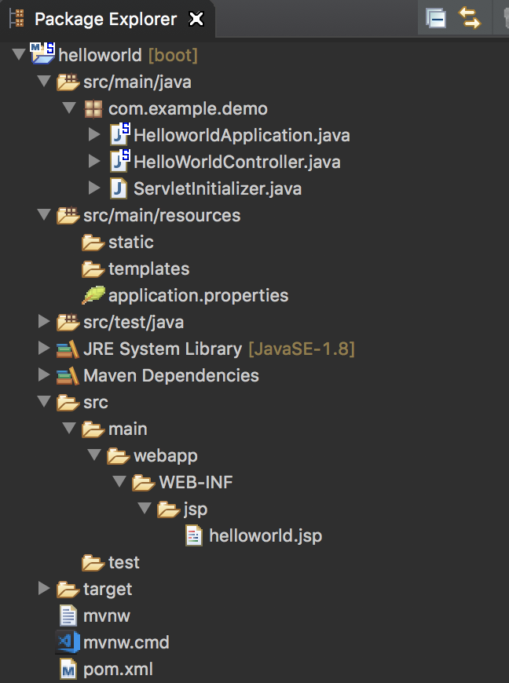
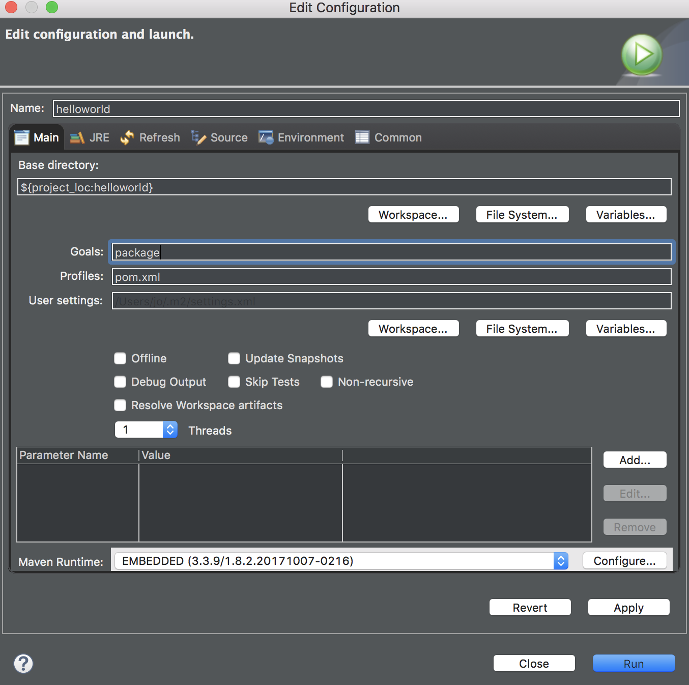
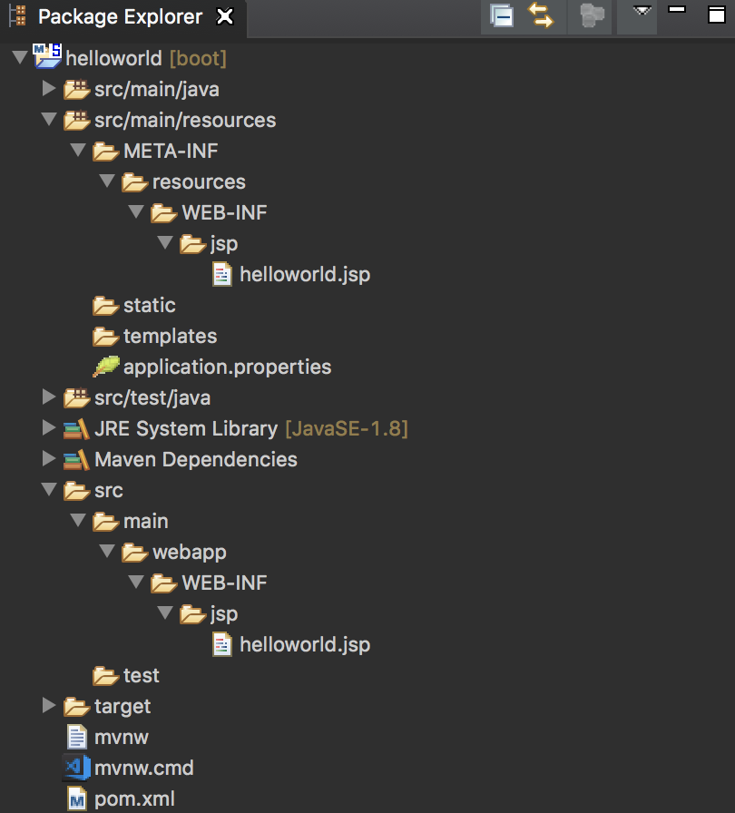

# Spring Boot (Jar run JSP 404 not found)
* 스프링부트는 Spring 프로젝트가 제공하는 다양한 라이브러리와 프레임워크로 단독실행되는, 실행하기만 하면 되는 상용화 가능한 수준의, 스프링 기반 애플리케이션을 쉽게 만들어낼 수 있다.
* 최소한의 설정으로 스프링 플랫폼과 서드파티 라이브러리들을 사용할 수 있도록 하고 있다.


### 스프링부트 기능
> 사용하려는 컨포넌트를 종속적으로 추가하면 @EnableAutoConfiguration 에노테이션으로 결합에 필요한 설정이 자동으로 이루어진다.
> 기본설정되어 있는 'starter' 컴포넌트들을 쉽게 추가
> Maven이나 Gradle 같은 빌드 도구를 사용한다(Ant로는 가능하지 않다)
> Web 어플리케이션의 경우, 내장 Tomcat을 시작 (Jetty와 Undertow로 전환 가능).
> 단독실행가능한 스프링애플리케이션을 생성한다.
> 빌드하면 단일 jar 파일이 생긴다.
> 상용화에 필요한 통계, 상태 점검 및 외부설정을 제공


## Spring Boot 프로젝트 빌드
* Maven Wrapper(mvnw)가 설정된 프로젝트는 별도로 Maven을 설치 하지 않아도 빌드를 할 수 있다. 프로젝트 폴더로 이동후 아래와 같은 명령어를 터미널 창에 입력을 하거나 STS(Spring Tool Suite)에서 프로젝트에서 우클릭 -> Run AS -> Maven Build를 클릭하게 되면 해당 프로젝트의 target폴더 아래에 jar 혹은 war 파일이 생긴다.
* Spring boot 는 프로젝트 생성시 기본적으로 Maven 과 Gradle을 지원 하며 Gradle 또한 Maven Wrapper(mvnw) 과 같이  gradlew 가 있어 별도로 Gradle 을 설치 하지 않고서도 gradlew로 빌드가 가능하다.


```
$ ./mvnw clean install

$ ./mvnw package
```


## 프로젝트 실행
흔한 방법중 하나는 java 의 -jar  옵션을 이용하여 jar 파일을 실행하는 것이다.

* java -jar springboot-0.0.1-SNAPSHOT.jar


# Whitelabel Error Page(404 Not Found)에러

This application has no explicit mapping for /error, so you are seeing this as a fallback.

Wed Apr 11 20:21:02 KST 2018

There was an unexpected error (type=Not Found, status=404).

/WEB-INF/jsp/helloworld.jsp

> 그동안 Spring MVC를 사용하면서 프로젝트를 war파일로 빌드하여 톰캣을 설치한 후 톰캣위에 war을 올려서 사용했었다.
>
> Spring Boot는 내장 톰캣이 있기 때문에 따로 war 파일로 빌드 하여 톰캣에 올릴 필요 없이 jar 파일만 실행 시켜도 실행이 가능하다고 하였었다.
>
> 하지만 jar 파일을 실행 시킨후 크롬 화면에서는 Whitelabel Error Page 이라는 에러 메시지를 표시하였다.
>
> STS(Spring Tool Suite)와 같은 IDE 실행에서는 정상 작동을 하였지만 java -jar 옵션을 이용한 jar 파일은 JSP 화면이 나타나지 않았다.

![404] (./img/404.png) 


## Spring Boot 프로젝트 설정

> 기존의 jar 파일로 빌드 하였을 때 설정

* Pom.xml 아래의 dependency를 추가 

  ```
  		<dependency>
  			<groupId>org.springframework.boot</groupId>
  			<artifactId>spring-boot-starter-web</artifactId>
  		</dependency>

  		<dependency>
  			<groupId>org.springframework.boot</groupId>
  			<artifactId>spring-boot-starter-tomcat</artifactId>
  			<scope>provided</scope>
  		</dependency>

  		<!-- JSP -->
  		<dependency>
  			<groupId>org.apache.tomcat.embed</groupId>
  			<artifactId>tomcat-embed-jasper</artifactId>
  		</dependency>

  		<dependency>
  			<groupId>javax.servlet</groupId>
  			<artifactId>jstl</artifactId>
  		</dependency>
  ```

* application.properties 아래의 코드 추가

  ```
  spring.mvc.view.prefix: /WEB-INF/jsp/
  spring.mvc.view.suffix: .jsp
  ```

* Jsp 파일 위치 및 폴더 구조

  ```
  /helloworld/src/main/webapp/WEB-INF/jsp
  ```

  

* (STS 기준) Build Goals 는 package 라고 적으면 된다.
  

# 해결방법(solution)

> * 기본적으로 jar 로 된 빌드 파일은 Jsp 를 지원하지 않습니다. (spring boot 에서 이제 JSP 를 지원 안하는듯...)
> * Spring Boot 1.4.2 버전 이하
> * Spring Boot 1.4.2 버전 이상


### 1. Spring Boot 1.4.2 버전 이하

> Spring Boot프로젝트 빌드 파일을 Jar 파일로 만들어서 JSP 화면을 이용하고 싶다면 JSP 파일위치를 아래와 같이 한다.
>
> ```
> /helloworld/src/main/resources/META-INF/resources/WEB-INF/jsp
> ```
>
> jar 파일을 빌드한후 java -jar springboot-0.0.1-SNAPSHOT.jar 을 실행 시키면 JSP 화면이 나올것이다.
>
> 
>
> 하지만 STS(Spring Tool Suite) 와 같은 IDE에서는 작동 하지 않을 것이다.
>
> 이럴 경우에는 아래의 위치에도 폴더 생성후 JSP 파일을 두면 IDE 에서 실행 하였을 경우에도 JSP 화면이 나타날것이다.
>
> ```
> /helloworld/src/main/webapp/WEB-INF/jsp
> ```




### 2. Spring Boot 1.4.2 버전 이상

>기존 프로젝트 설정과 동일 하며 jar 파일 대신 war 파일로 Spring Boot 프로젝트를 빌드 하면된다.
>
>JSP 파일 위치는 기존 프로젝트 설정과 마찬가지로 아래의 폴더 구조에 JSP 파일이 위치하면 된다. (이전과 설정과 동일)
>
>```
>/helloworld/src/main/webapp/WEB-INF/jsp
>```
>
>* java -jar springboot-0.0.1-SNAPSHOT.war 을 실행시키면 JSP 화면이 나타나게 된다.
>* 개인 적으로 jar 파일 대신 war 파일로 빌드하여 실행하는 것이 이전 1.4.2버전 이하보다  간단하다고 생각이된다.

#### 결과화면


